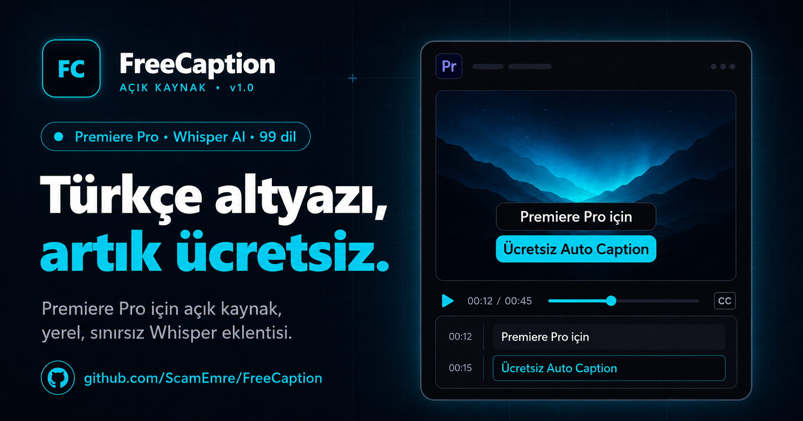

<div align="center">



# FreeCaption

**Adobe Premiere Pro için açık kaynak, yerel, sınırsız Türkçe & İngilizce otomatik altyazı eklentisi**

[](LICENSE.md)
[](#kurulum)
[](#sistem-gereksinimleri)
[](#-uzak-sunucu-vds-kurulumu--opsiyonel)
[](#)

*Sesi kelime kelime altyazıya çevir — saniyeler içinde, GPU ile, gizliliği koruyarak.*

[🌐 Tanıtım](landing/index.html) · [Kurulum](#kurulum) · [Nasıl Çalışır](#nasıl-çalışır) · [VDS Kurulumu](#-uzak-sunucu-vds-kurulumu--opsiyonel) · [SSS](#sss) · [Geliştirici](#geliştirici)

</div>

---

## Neden FreeCaption?

Türk video editörlerin yıllardır beklediği şey: **Premiere Pro'da Türkçe otomatik altyazı, ücretsiz ve açık kaynak.** Adobe'un yerleşik Speech-to-Text özelliği Türkçeyi desteklemiyor. Ticari eklentiler (Kaps, Subs) çalışıyor ama aylık ücret istiyor ve videolarını **buluta upload** ediyor.

**FreeCaption farklı:**

| | FreeCaption | Kaps / Subs | Adobe yerleşik |
|---|:---:|:---:|:---:|
| Türkçe destek | ✅ | ✅ | ❌ |
| Açık kaynak | ✅ | ❌ | ❌ |
| Yerel işleme | ✅ | ❌ (cloud) | ❌ (cloud) |
| Ücret | **Ücretsiz** | Abonelik | Creative Cloud |
| Dosya boyutu limiti | Yok | Var | Var |
| Word-level senkron | ✅ (WhisperX) | Kısmen | Hayır |
| Aylık kullanım limiti | Sınırsız | Kotalı | Sınırlı |

---

## Özellikler

- 🎯 **Word-level alignment** — Whisper large-v3 + WhisperX forced alignment ile ±20ms hassasiyet
- 🇹🇷 **Türkçe & İngilizce** + otomatik dil tespit (97 dil destekli teknoloji)
- 🚀 **GPU hızlandırma** — RTX 50/40/30 serisi (CUDA 12.8 sm_120 dahil)
- 🔒 **Tamamen yerel** — videolarınız sunucuya gönderilmez, gizliliğiniz korunur
- ♾️ **Sınırsız kullanım** — hiçbir API kotası, aylık limit, dosya boyutu sınırı yok
- 🎨 **Tek satır altyazı** — karakter sınırı + akıllı tolerans, Premiere'de 2 satıra wrap olmaz
- 📥 **Otomatik timeline entegrasyonu** — caption track yoksa oluşturur, SRT'yi yerleştirir
- ⚡ **Sessiz arka plan** — bilgisayar açılışında otomatik başlar, hiçbir pencere açılmaz

---

## Kurulum

### Sistem Gereksinimleri

- **Windows 10/11**
- **Adobe Premiere Pro 23.0+** (2023, 2024, 2025, 2026, 2027 betası)
- **Python 3.10-3.12** (kurulum sırasında otomatik kontrol edilir)
- **FFmpeg** (kurulum sırasında otomatik yüklenir)
- **NVIDIA GPU (opsiyonel ama önerilen)** — RTX 20/30/40/50 serisi
  - GPU yoksa CPU modunda çalışır (5-10x daha yavaş)

### Adım 1 — Bilgileri Yükle

```bash
git clone https://github.com/ScamEmre/FreeCaption.git
cd FreeCaption
```

veya **Code → Download ZIP** olarak indir ve istediğin yere çıkar.

### Adım 2 — Python + Bağımlılıklar

`install.bat` dosyasına **çift tıkla**. Sihirbaz:
1. Python kurulu mu kontrol eder, yoksa kurulum linki gösterir
2. FFmpeg yoksa `winget` ile otomatik yükler
3. Sanal ortam (`.venv`) oluşturur
4. PyTorch (GPU varsa CUDA 12.8) + Whisper + WhisperX yükler

⏱️ İlk kurulum: 5-15 dakika (~5 GB internet + disk).

### Adım 3 — CEP Plugin'i Premiere'e Bağla

`cep_kur.bat` dosyasına çift tıkla. Sihirbaz:
1. CEP debug modunu Windows registry'e yazar
2. Plugin'i `%APPDATA%\Adobe\CEP\extensions\FreeCaption` klasörüne kopyalar

Premiere'i yeniden başlat. **Window → Extensions → FreeCaption** menüsünden paneli aç.

### Adım 4 — Sunucuyu Başlat

`start.bat` dosyasına çift tıkla — görünür terminalde Python sunucusu başlar.

Bilgisayar her açıldığında otomatik başlasın istersen: `autostart_kur.bat` çalıştır.

> **Veya:** Panel üzerindeki **▶ Sunucu Başlat** butonu da aynı işi yapar.

---

## 🌐 Uzak Sunucu (VDS) Kurulumu — Opsiyonel

Birden fazla kişi kullanacaksa veya ekibin için merkezi bir Whisper sunucusu istiyorsan: VDS'ye **tek tuşla** kur, panelden URL + API Key ile bağlan.

### VDS Önkoşulları

- Windows Server 2019/2022 (Türk VDS sağlayıcı + dedicated CPU önerilir)
- 4+ dedicated core, 8 GB RAM, 25 GB disk
- RDP + admin PowerShell erişimi

### Tek Tuşla Kurulum (PowerShell ADMIN)

```powershell
Set-ExecutionPolicy -Scope Process Bypass -Force
$u = "https://raw.githubusercontent.com/ScamEmre/FreeCaption/HEAD/deploy/windows/install_windows.ps1"
Invoke-WebRequest $u -OutFile "$env:TEMP\install.ps1" -UseBasicParsing
& "$env:TEMP\install.ps1"
```

Script otomatik:
- Python 3.12, Git, FFmpeg, NSSM, Caddy indirir
- Microsoft Visual C++ Redistributable kurar
- Venv + PyTorch CPU + faster_whisper + ctranslate2 4.4.0 + intel-openmp yükler
- Whisper medium modelini ön-yükler (1.5 GB)
- 2 Windows servisi kurar (FreeCaption API + Caddy proxy, auto-start)
- Firewall 80/443 açar
- Random API Key üretir, ekrana yazar

Toplam: ~15 dakika, sıfırdan production-ready.

### Premiere Panel'i Sunucuya Bağla

Panel'de **⚙ Sunucu Ayarları** butonu:
- URL: `http://<VDS_IP>` veya `https://api.YOURDOMAIN.com`
- API Key: install script'in verdiği random key (kayıtlı: `C:\FreeCaption\.env`)

Health badge yeşil olunca tamam — transcribe artık sunucuda çalışır.

> Detaylı VDS kılavuzu: [01_Rehberler_ve_Raporlar/VDS_DEPLOYMENT.md](../../01_Rehberler_ve_Raporlar/VDS_DEPLOYMENT.md)

---

## Nasıl Çalışır?

```
┌──────────────────────────────────────────────┐
│  Adobe Premiere Pro                          │
│                                              │
│  Window → Extensions → FreeCaption Panel       │
│  • Klibi seç                                 │
│  • Karakter sınırı belirle (örn. 25)         │
│  • "Altyazı Üret" tuşu                       │
└────────────────────┬─────────────────────────┘
                     │
                     ▼ HTTP (localhost)
       ┌───────────────────────────────┐
       │ Python Sunucu (FastAPI)       │
       │ ↓                             │
       │ FFmpeg ses çıkar (16kHz WAV)  │
       │ ↓                             │
       │ Whisper large-v3 (GPU/CPU)    │
       │ ↓                             │
       │ WhisperX forced alignment     │
       │ ↓                             │
       │ Akıllı SRT oluştur            │
       └────────────────────┬──────────┘
                            │
                            ▼ SRT dosyası
       ┌───────────────────────────────┐
       │ ExtendScript:                 │
       │ seq.createCaptionTrack()      │
       │ → Caption track + altyazı     │
       │   timeline'a otomatik düşer   │
       └───────────────────────────────┘
```

### Bileşenler

- **`backend/`** — Python FastAPI sunucusu, Whisper + WhisperX motoru
- **`cep-plugin/`** — Premiere CEP eklentisi, ExtendScript ile timeline entegrasyonu
- **`frontend/`** — Standalone web UI (Premiere kurulu olmasa da çalışır)

---

## Kullanım

### Premiere içinden (önerilen)

1. **Window → Extensions → FreeCaption** panelini aç
2. Timeline'da bir klibe tıkla (audio veya video, fark etmez)
3. Sağ üstte 🟢 "GPU: NVIDIA GeForce ..." yazısını kontrol et (sunucu hazır)
4. **Karakter sınırı** seç:
   - **20** — TikTok/Reels tarzı çok kısa altyazılar (tek satır kesin)
   - **25** — Dengeli (önerilen, tek satır)
   - **30+** — Geniş, ama büyük font'ta 2 satıra wrap olabilir
5. **Altyazı Üret** tuşuna bas
6. 10-30 saniye sonra altyazı **otomatik olarak C1 caption track'e** düşer

### Premiere'siz (standalone web UI)

`start_hidden.vbs` çalışırken tarayıcıda **http://127.0.0.1:7860** aç. Drag&drop ile video/ses dosyası, SRT indir.

---

## Performans

| Senaryo | RTX 4060+ | RTX 3060 | CPU (i5-12400) |
|---|:---:|:---:|:---:|
| 10 saniye ses | ~3 sn | ~5 sn | ~30 sn |
| 1 dakika ses | ~8 sn | ~15 sn | ~3 dk |
| 10 dakika ses | ~45 sn | ~90 sn | ~25 dk |

İlk çalıştırmada Whisper modeli (~3 GB) indirilir, **bir kerelik**. Sonrasında saniyeler içinde sonuç.

---

## SSS

**S: Videolarım bir yere upload mu ediliyor?**
A: Hayır. Tüm işlem bilgisayarında yapılır. İnternet bağlantısı yalnızca ilk Whisper modelini indirmek için gerekir.

**S: Aylık kullanım limiti var mı?**
A: Yok. Tamamen sınırsız.

**S: Premiere kapalıyken çalışır mı?**
A: Evet, `http://127.0.0.1:7860` adresinde web UI var. Drag&drop ile SRT üret.

**S: Hangi Premiere sürümleri desteklenir?**
A: Premiere Pro 2023 (23.0) — 2027 betası dahil.

**S: AMD/Intel GPU desteği?**
A: Şu an sadece NVIDIA CUDA. AMD ROCm desteği yol haritasında.

**S: CEP Eylül 2026'da kapanmıyor mu?**
A: Adobe CEP'in son tarihini birkaç kez uzattı. UXP yeterince olgunlaştığında UXP versiyonu da çıkar.

**S: Diğer dil desteği?**
A: Whisper 99 dil destekli — UI'da TR/EN seçeneği var ama API'ye `language` parametresi ile başka diller verilebilir.

---

## Geliştirici

**Emre Kazak** — [emrekazak.com](https://emrekazak.com) · [GitHub](https://github.com/emrekazak)

Adobe için ücretli/kapalı kaynak çözümlerin (Kaps, Subs) Türk video editörlerine pahalıya gelmesi üzerine **açık kaynak, yerel ve sınırsız** alternatif geliştirme amacıyla başladı.

---

## Katkıda Bulun

Pull request'ler memnuniyetle karşılanır. Büyük değişiklikler için önce bir [issue](https://github.com/ScamEmre/FreeCaption/issues) açarak tartışalım.

Detaylı rehber: [CONTRIBUTING.md](CONTRIBUTING.md) · Değişiklik geçmişi: [CHANGELOG.md](CHANGELOG.md)

### Roadmap

- [ ] AMD GPU (ROCm) desteği
- [ ] macOS native binary
- [ ] Otomatik altyazı stilleri (font, renk, konum) — Premiere caption preset
- [ ] Çoklu konuşmacı ayrımı (diarization, WhisperX `--diarize`)
- [ ] Konfigürasyon paneli (özel modeller, custom prompts)
- [ ] UXP versiyonu (Premiere 27+ resmi caption API stabilleşince)

---

## Teşekkürler

Bu proje şu açık kaynak araçlar üzerine inşa edildi:

- [OpenAI Whisper](https://github.com/openai/whisper) — temel ASR modeli
- [WhisperX (m-bain)](https://github.com/m-bain/whisperX) — word-level forced alignment
- [faster-whisper (SYSTRAN)](https://github.com/SYSTRAN/faster-whisper) — 4x hızlı Whisper
- [Adobe-CEP/Samples](https://github.com/Adobe-CEP/Samples) — `createCaptionTrack` referans implementasyonu
- [PyTorch](https://pytorch.org/) — model çalıştırma motoru
- [FastAPI](https://fastapi.tiangolo.com/) — Python web framework

---

## Lisans

[MIT](LICENSE.md) — özgürce kullan, değiştir, dağıt. Sadece telif bildirimini koru.

---

<div align="center">

**Beğendiyseniz ⭐ verin, yardımcı olduysa paylaşın.**

[emrekazak.com](https://emrekazak.com) · Made with ❤️ in Türkiye

</div>
